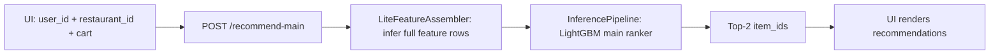
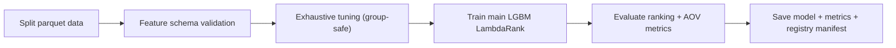

# Restaurant Order Recommendation System (CSAO)

This repository is the full hackathon submission package for a contextual cart add-on recommendation system inspired by Zomato-like ordering flows.

It contains:
- End-to-end training/evaluation code for the main ranking model.
- A production-style FastAPI backend.
- A realistic UI with live top-2 recommendations.
- Included train/val/test splits and trained model artifact for reproducibility.
- Deployment assets for Hugging Face Spaces (Docker).
- The original data-generation notebook (kept unchanged): `zomato_csao_datagen_2.ipynb`.

---

## 1) Problem Statement and Goal

Given:
- user context,
- restaurant context,
- current cart state,
- candidate menu items from the selected restaurant,

predict the best next add-on items to recommend in real time, prioritizing:
- relevance to current cart state,
- diversity across decision contexts,
- business utility (evaluated via expected AOV lift),
- low online latency.

---

## 2) What This Submission Includes

### Core code
- `csao/models/train.py`: training pipeline, tuning, evaluation, artifact writing.
- `csao/models/lgbm_ranker.py`: LightGBM ranker wrapper + preprocessing.
- `csao/models/inference.py`: online scoring/recommendation pipeline.
- `csao/evaluation/ranking_metrics.py`: ranking + business metrics.
- `csao/data/loader.py`: split loading and schema checks.

### Serving and UI
- `csao/serving/api.py`: FastAPI routes (`/recommend`, `/recommend-main`, `/recommend-lite`, UI endpoints).
- `csao/serving/lite_features.py`: minimal-input to full-feature assembly.
- `csao/serving/ui_backend.py`: existing user list, restaurants, menu, combos.
- `csao/serving/static/index.html`, `styles.css`, `app.js`: frontend.
- `csao/serve_pretrained.py`: serve pretrained main model without retraining.

### Data and artifacts
- `csao_data/cart_sessions_train.parquet`
- `csao_data/cart_sessions_val.parquet`
- `csao_data/cart_sessions_test.parquet`
- `csao_models/lgbm_ranker_main.joblib`
- `csao_models/metrics_summary.json`
- `csao_models/registry/` (historical runs and run registry)

### Repro and ops scripts
- `analyze_cart_sessions.py`: exploratory analysis helper.
- `csao/tools/recommend_latency_check.py`: endpoint latency test.
- `deploy_hf_space.sh`: one-command HF Space deployment helper.
- `REPRODUCE.md`: reproducibility quick guide.
- `Dockerfile`, `.dockerignore`, `.gitattributes`: deployment/versioning support.

---

## 3) End-to-End Architecture



Offline training architecture:



---

## 4) Data Contracts

### Ranking group
- Group key: `["session_id", "step"]`
- Candidate identifier: `candidate_item_id`
- Main target: `added` (binary relevance for ranking)

### Splits
- `train`, `val`, `test` from `csao_data/*.parquet`

### Required base columns
- `session_id`, `step`, `candidate_item_id`, `split`
- `added`, `revenue_weighted_label`, `aov_lift_if_added`, `candidate_popularity`

---

## 5) Full Feature Set and Interaction Logic

The model uses 49 features (from `csao/config/config.yaml`).

### Context + cart state features
- `step`, `hour`, `city`, `meal_slot`
- `cart_total`, `cart_size`, `cart_momentum`
- `has_main`, `has_side`, `has_drink`, `has_dessert`, `has_snack`
- `weather_temp_c`, `is_hot_weather`

### Candidate/item features
- `candidate_category`, `candidate_cuisine_tag`
- `candidate_price`, `candidate_is_veg`, `candidate_calories`
- `candidate_popularity`, `candidate_margin_score`, `candidate_revenue_potential`
- `candidate_in_price_sweet_spot`, `candidate_slot_urgency`
- `aov_lift_if_added`

### User features (requested explicitly)
- `user_segment`
- `user_avg_order_value`
- `user_is_veg`
- `user_orders_per_month`
- `user_ordered_before`
- `user_cuisine_affinity`
- `user_addon_rate_30d`
- `user_drink_rate_30d`
- `user_dessert_rate_30d`
- `user_addon_rate_this_slot`
- `user_price_upgrade_tendency`
- `user_days_since_last_order`
- `user_orders_30d`
- `user_orders_7d`
- `user_median_item_price_90d`
- `is_cold_start`

### Restaurant features
- `rest_cuisine`, `rest_price_tier`, `rest_rating`, `rest_avg_margin`

### Cross-item/cart interaction features
- `price_delta_cart_avg`: candidate price minus cart/user reference price.
- `weather_drink_affinity`: high when hot weather + drink-like category.
- `pair_max_lift`: strongest learned pair affinity from cart item to candidate.
- `pair_seen_before_flag`: whether this cart->candidate pair has positive history.

### How interactions are inferred online
- Minimal request (`user_id`, `restaurant_id`, `cart_item_ids`) is expanded into full model rows.
- Cart category flags are derived from item category keywords.
- Cold-start users keep stable defaults (`is_cold_start=1`, fallback user activity stats).
- Pair-affinity features are computed from historical positive cart-candidate co-occurrence.

---

## 6) Training Methodology

### Model family
- LightGBM `lambdarank` with grouped ranking by `(session_id, step)`.

### Main training setup
- Objective: ranking quality + coverage/diversity pressure via weighted tuning objective.
- Early stopping enabled with guardrail for pathological ultra-early stops.
- Final main model path: `csao_models/lgbm_ranker_main.joblib`.

### Hyperparameter search
- Exhaustive grid search enabled.
- Search space:
  - `learning_rate`: `[0.01, 0.02, 0.03]`
  - `num_leaves`: `[31, 63, 127]`
  - `min_child_samples`: `[10, 20, 40]`
  - `colsample_bytree`: `[0.7, 0.85]`
- Total trials: `54` (exhaustive).
- Group-preserving sampling for tuning speed:
  - train groups: `0.7`
  - val groups: `1.0`

### Tuning objective
Weighted score:
- `1.00 * ndcg@5`
- `0.10 * recall@5`
- `0.05 * coverage@5`
- `0.08 * cart_state_diversity@1`

### Business model status
- Business training path exists in code but is disabled in active config:
  - `training.train_business_model: false`
- This submission uses the **main model** for production serving.

---

## 7) Evaluation Methodology

Evaluated on test split with grouped ranking:
- `ndcg@5`
- `precision@5`
- `recall@5`
- `auc`
- `coverage@5`
- `cart_state_diversity@1` (custom)
- `expected_aov_lift`
- step-wise metric breakdown (`step=0..3`)

Metric implementations:
- `csao/evaluation/ranking_metrics.py`

Latest summary:
- `csao_models/metrics_summary.json`

### Latest main-model results

| Metric | Baseline | Main |
|---|---:|---:|
| ndcg@5 | 0.2578 | 0.4564 |
| precision@5 | 0.0751 | 0.1159 |
| recall@5 | 0.3755 | 0.5796 |
| auc | 0.5776 | 0.6469 |
| coverage@5 | 0.3387 | 0.9245 |
| cart_state_diversity@1 | 0.4867 | 0.8023 |
| expected_aov_lift | 1.1791 | 1.7728 |

Projected uplift vs baseline:
- Main: `+50.35%`

---

## 8) API and UI Behavior

### UI constraints
- Existing users only (from training universe).
- All restaurants from training universe.
- Add items/combos to cart.
- Show top-2 recommendations only.

### Serving endpoints
- `GET /health`
- `GET /`
- `GET /ui`
- `GET /ui/options`
- `GET /ui/restaurants/{restaurant_id}/menu`
- `POST /ui/session-candidates` (legacy two-step UI flow support)
- `POST /recommend` (rank already-built candidate rows)
- `POST /recommend-main` (**single-call main model path**)
- `POST /recommend-lite` (backward-compatible alias)

---

## 9) Latency Work: What Was Changed and Why

### Original bottleneck
UI made two sequential network calls per cart update:
1. `/ui/session-candidates`
2. `/recommend`

This doubled network and JSON serialization overhead.

### Implemented latency reductions
1. Added single-call endpoint:
   - `/recommend-main` (minimal request -> feature assembly -> main model rank).
2. Updated UI to call `/recommend-main` directly.
3. Added lazy service initialization in API:
   - faster container startup.
4. Made root `/` return `200` UI response:
   - avoids startup health-check issues in Space runtimes.
5. Fixed serve port default to `7860` for HF Docker Spaces.

### Measured impact (HF deployment)
- Two-call path: typically ~530-600+ ms.
- Single-call path: typically ~280-330 ms steady-state.
- First cold request can still be slower due to warm-up.

---

## 10) Local Setup and Run

### A) Run pretrained model + UI (recommended for evaluation)

```bash
python -m venv .venv
source .venv/bin/activate
pip install -r requirements.txt
python -m csao.serve_pretrained
```

Open:
- `http://localhost:7860/ui`

### B) Retrain + evaluate + serve

```bash
python -m csao.main
```

Note:
- Business training remains disabled by config.
- Main model is retrained and overwritten in `csao_models/`.

### C) Latency probe

```bash
python -m csao.tools.recommend_latency_check --url http://localhost:7860/recommend --runs 20 --top-k 2
```

---

## 11) Hugging Face Space Deployment

Deployment files are included:
- `Dockerfile`
- `.dockerignore`
- `.gitattributes`
- `deploy_hf_space.sh`

Prerequisites:
- `hf auth login` with write token
- `git-lfs` installed

Deploy:

```bash
./deploy_hf_space.sh <owner/space-name> [public|private]
```

Current Space used during testing:
- `aadityakshatriya/zomathon`

---

## 12) Script and Module Index (Presentation Inventory)

### Data and analysis
- `zomato_csao_datagen_2.ipynb`: dataset generation notebook (unchanged).
- `analyze_cart_sessions.py`: additional exploratory analysis.
- `csao/data/loader.py`: load/validate split datasets.

### Modeling
- `csao/models/train.py`: full training and evaluation pipeline.
- `csao/models/lgbm_ranker.py`: model wrapper, transformations, fit/predict.
- `csao/models/inference.py`: runtime recommendation logic.
- `csao/evaluation/ranking_metrics.py`: metric computation.

### Serving and frontend
- `csao/serve_pretrained.py`: startup entrypoint without retraining.
- `csao/serving/api.py`: FastAPI app and routes.
- `csao/serving/lite_features.py`: online feature assembly from minimal input.
- `csao/serving/ui_backend.py`: users/restaurants/menu/combo read APIs.
- `csao/serving/static/app.js`: frontend interaction + live recommendation calls.
- `csao/serving/static/index.html`, `styles.css`: UI layout and styles.

### Artifacts and operations
- `csao_data/*`: train/val/test parquet splits.
- `csao_models/*`: model artifacts + metrics + registry.
- `deploy_hf_space.sh`: automated HF deployment.
- `REPRODUCE.md`: concise reproduction guide.

---

## 13) Key Design Ideas Captured in This Repo

- Keep online input minimal (`user_id`, `restaurant_id`, `cart_item_ids`) while inferring full model feature space server-side.
- Prioritize cart-state relevance with pair-affinity features and cart-derived interaction features.
- Track recommendation diversity explicitly with `cart_state_diversity@1`.
- Balance ranking quality and catalog spread through weighted tuning objective.
- Preserve simple evaluator UX: existing users only, all restaurants, top-2 recs, add-to-cart loop.
- Deployability first: Dockerized, HF-ready, reproducible artifacts committed.

---

## 14) Submission Notes

- This repo is intended as a complete, evaluator-ready codebase for the hackathon submission.
- The data-generation notebook was intentionally preserved unchanged.
- The active production path uses the **main** model.
